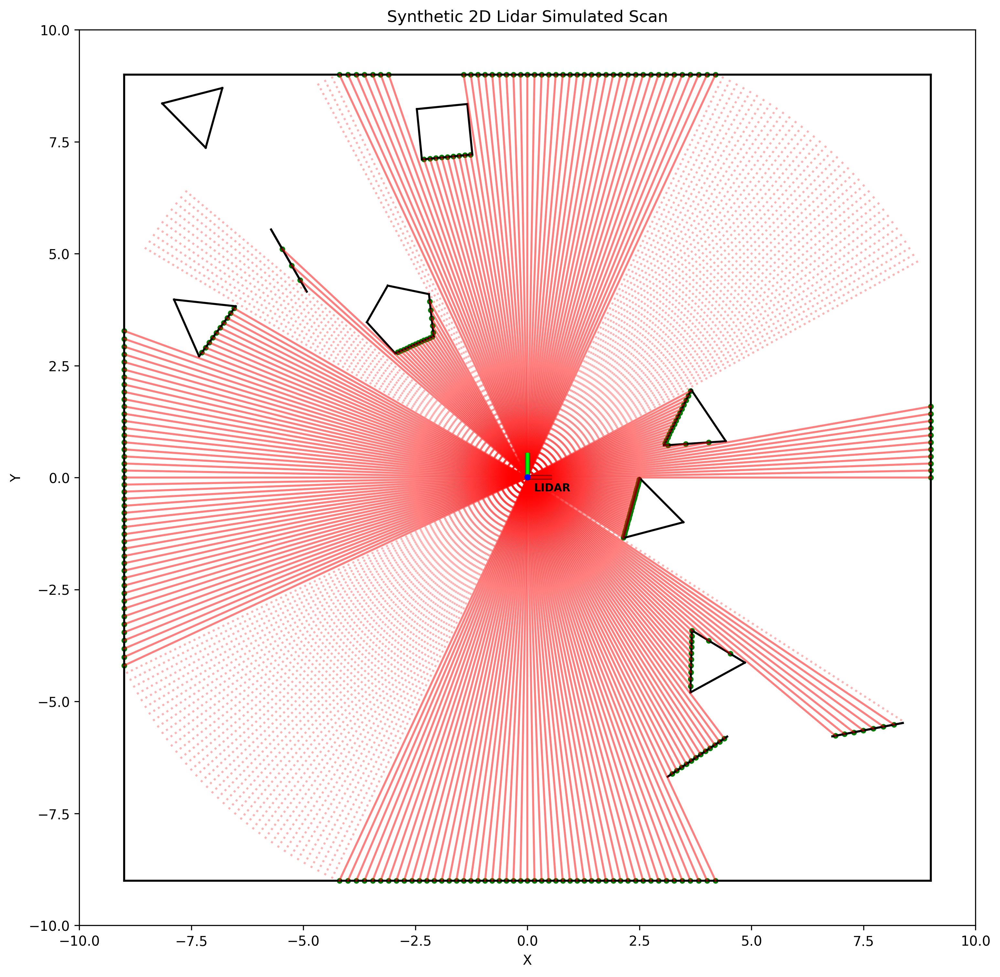

# Synthetic 2D Lidar Scan Generator

This repository contains a Python-based simulation of a 2D LiDAR sensor in a warehouse environment. The simulation generates artificial LiDAR scans, detects obstacles, and visualizes the results.

### Motivation

The motivation behind developing this simulator stems from the lack of readily available projects for quickly prototyping and developing algorithms for 2D LiDAR sensors. By sharing this simulator, the aim is to facilitate the rapid development and testing of LiDAR algorithms in a controlled virtual environment. <br> 
The simulator is intentionally kept simple and can be further improved and expanded to meet specific research or application needs.

## Requirements

- Python 3.x
- See `requirements.txt` for Python package dependencies.

To install the required packages, run the following command:

```bash
pip install -r requirements.txt
```

## Project Structure

- `lidar_simulation.ipynb`: Jupyter Notebook containing the LiDAR simulation code.
- `plot.png`: Output plot of the LiDAR scan.

## Usage

1. **Viewing the Notebook**:
   - Open the [Synthetic2DLidarScanGenerator.ipynb](Synthetic2DLidarScanGenerator.ipynb) file in [Jupyter notebook](https://jupyter.org/install) to view/use the notebook.

2. **Running the Simulation**:
   - Adjust parameters such as `num_beams`, `max_range`, and `scan_angle` to customize the simulation.
   - Execute the code cells in `lidar_simulation.ipynb` to generate a synthetic LiDAR scan.

3. **Visualization**:
   - The LiDAR scan will be plotted with obstacles randomly generated within the warehouse boundaries.
   - The generated plot (`plot.png`) shows the LiDAR scan lines, detected obstacles, and valid points.

## Examples



## License

This project is licensed under the [BSD 3-Clause License](LICENSE).
